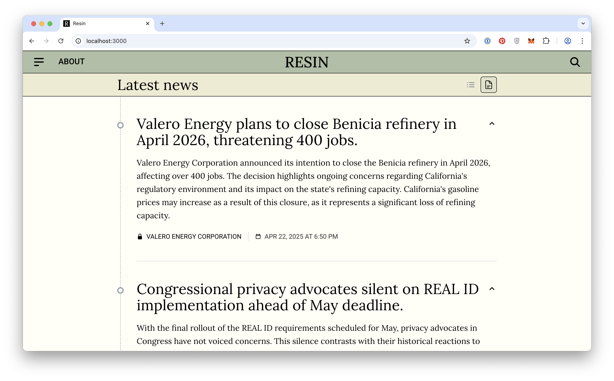

**Resin** is an automated news system that removes journalists and opinions and surfaces fact-only data directly to readers.

[https://resin.news](https://resin.today/)



## Architecture

- **Frontend:** Next.js (React, TypeScript)
- **Backend:** Serverless (Node.js)
- **Data:** LLM ingestion pipeline
- **Database:** Neon (Postgres)
- **Testing:** Playwright + Jest
- **Styling:** Tailwind CSS
- **Tooling:** ESLint + Prettier
- **CI/CD:** Github Workflows
- **Cloud:** Vercel

## Running locally

```bash
>  nvm use       # Load NPM version
>  npm install   # Install dependencies
>  npm run dev   # Serve app locally
```

Open [http://localhost:3000](http://localhost:3000) with your browser.
